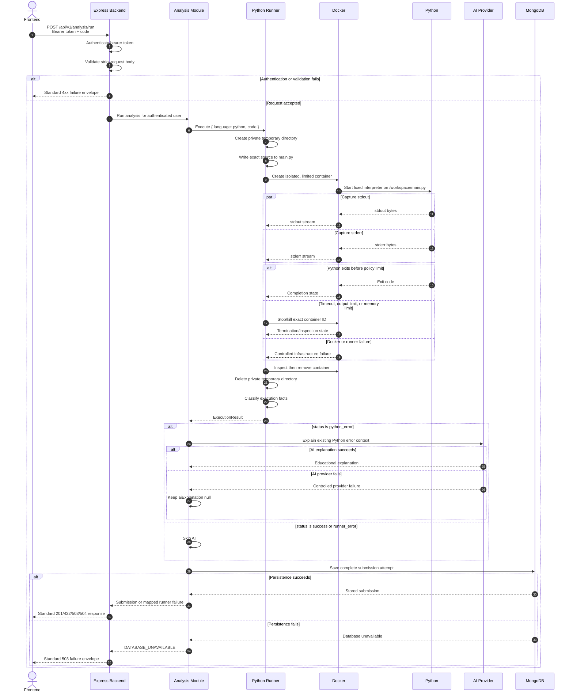

# Python Execution Sequence Diagram

## 1. Complete Lifecycle

The diagram shows the complete intended orchestration for one `POST /api/v1/analysis/run` request. The
Python Runner is an internal backend boundary, not a separately deployed service. Sprint 5 implements
the conditional AI branch without changing runner behavior.

## 2. Responsibility Notes

- **Frontend:** supplies the bearer token and Python source, then renders the backend result.
- **Backend:** owns HTTP authentication, validation, standard responses, and error translation.
- **Analysis Module:** orchestrates execution, conditional AI explanation, and persistence.
- **Python Runner:** owns workspace creation, Docker lifecycle, bounded capture, timing, classification,
  and cleanup.
- **Docker:** enforces the configured isolation and resource controls.
- **Python:** detects syntax/runtime errors and produces stdout, stderr, and an exit code.
- **AI Provider:** only explains an already classified `python_error` and cannot alter execution facts.
- **MongoDB:** stores every successful, Python-error, and runner-error attempt when available.

## 3. Ordering Guarantees

1. Authentication and request validation finish before temporary resources are created.
2. Container/workspace cleanup finishes before the runner result is handed to the analysis module.
3. AI is invoked only after Python has produced a `python_error` result.
4. Persistence occurs after the best-effort explanation attempt.
5. The frontend receives a success claim only after MongoDB confirms storage.

Cleanup failures are separate operational events and do not replace the primary execution result.
Startup reports and reconciles leftover runner-labeled containers and safely prefixed workspaces.
